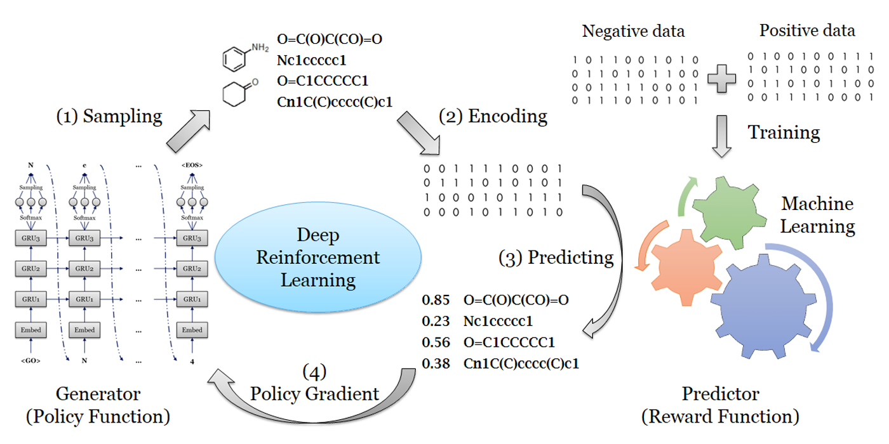
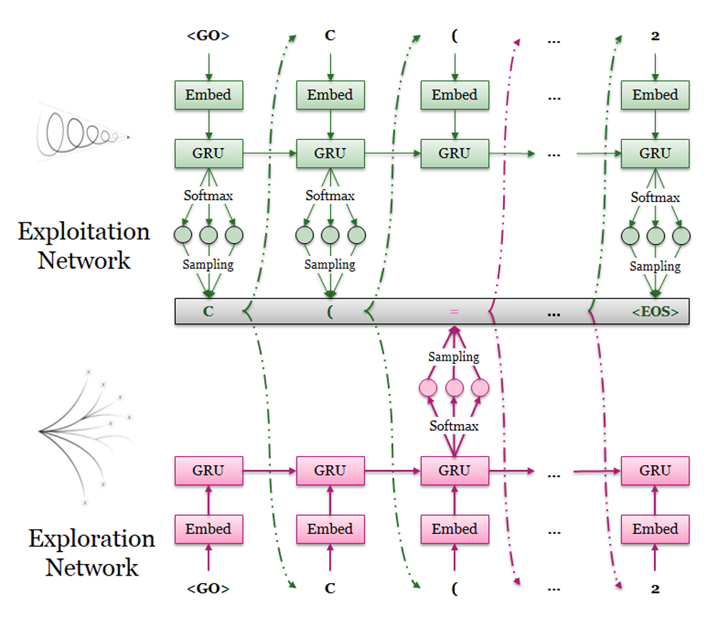
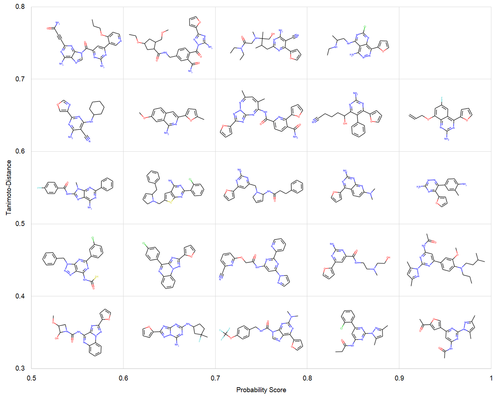

DrugEx RELEASE NOTES
====================
DrugEx (Drug Explorer): An explaration strategy improves the diversity of de novo drug design using deep reinforcement learning

By Xuhan Liu & Gerard J.P. van Westen, on November 1st 2018

Please see the LICENSE file for the license terms for the software. Basically it's free to academic users. If you do wish to sell the software or use it in a commercial product, then please contact the following E-mails:

   Xuhan Liu (First Author): x.liu@lacdr.leidenuniv.nl 

   or

   Gerard J.P. van Westen (Correspondent Author): gerard@lacdr.leidenuniv.nl

Introduction
=============
Over the last five years deep learning has progressed tremendously in both image recognition and natural language processing. Now it is increasingly applied to other data rich fields. In drug discovery, recurrent neural networks (RNNs) have been shown to be an effective method to generate novel chemical structures in the form of SMILES. However, ligands generated by current methods have so far provided relatively low diversity and do not fully cover the whole chemical space occupied by known ligands. Here, we propose a new method (DrugEx) to discover de novo drug-like molecules. DrugEx is an RNN model (generator) trained through a special exploration strategy integrated into reinforcement learning. As a case study we applied our method to design ligands against the adenosine A2A receptor. From ChEMBL data, a machine learning model (predictor) was created to predict whether generated molecules are active or not. Based on this predictor as the reward function, the generator was trained by reinforcement learning without any further data. We then compared the performance of our method with two previously published methods, REINVENT and ORGANIC. We found that candidate molecules our model designed, and predicted to be active, had a larger chemical diversity and better covered the chemical space of known ligands compared to the state-of-the-art.

Workflow
========


Exploration Strategy
====================


Examples
=========


Installation
============
The code and its dependencies can be installed from GitHub with the following
commands:

```bash
$ git clone https://https://github.com/XuhanLiu/DrugEx.git drugex
$ cd drugex
$ pip install -e .
```

If you are installing dependecies manually the following should be satisfied:

1. Numpy: (version >= 1.14)

    `tcsh% pip install numpy`

2. Scikit-Learn (version >= 0.18)

    `tcsh% pip install scikit-learn`

3. Pandas (version >= 0.22)

    `tcsh% pip install pandas`

4. PyTorch (version == 1.0)

    `tcsh% conda install pytorch torchvision cudatoolkit=x.x -c pytorch` 
    
    Note: it depends on the GPU device and CUDA tookit (x.x is the version of CUDA)

5. Matplotlib (version >= 2.0)

    `tcsh% pip install matplotlib`
        
On mac, you may [need](https://github.com/pytorch/pytorch/issues/20030) to also
install `libomp` with:

```bash
$ brew install libomp
```

Usage
======
``drugex`` installs a command line interface that can be used to access the
scripts. Note: some of them haven't been ported to the CLI yet, and still
have to be accessed as python modules. For designing the novel drug molecules
with SMILES representation, you should do the following steps sequentially
by running:

1. `drugex dataset`: 
    Preparing your dataset for pre-training and fine-tuning the RNN model as
    initial states of exploitation network and exploration network. Run with:
    `drugex dataset -d data`.
2. `drugex environ`:
    Training your predictor as the environment for providing the final reward
    for the action from the agent. The performance can also be evaluated
    through n-fold cross validation and independent test. For example, to
    train on the A2AR data, run:
    - `drugex environ -p data/A2AR_raw.txt -a RF`
    - `drugex environ -p data/A2AR_raw.txt -a DNN`
    - `drugex environ -p data/A2AR_raw.txt -a KNN`
    - `drugex environ -p data/A2AR_raw.txt -a NB`
    - `drugex environ -p data/A2AR_raw.txt -a SVM`
3. `drugex pretrainer`:
    Pre-training the RNN model as initialization of exploitation network acted
    as agent for molecule design. Fine-tuning the same RNN model as exploration
    network which will be fixed as an perturbation to enlarge the diversity.
    Run with: `drugex pretrainer -d data/ -o output/ --use-tqdm`
4. `drugex agent`: 
    Training the DrugEx model under the reinforcement learning framework.
    During the training process, both of the exploitation and exploitation
    network will be involved in the SMILES generation, and the exploration rate 
    controls the contribution that exploration network makes. Run with:
    `drugex agent -d data/ -o output/`
5. `python -m drugex.designer`:
    Finally, generating the SMILES format molecules with well-trained RNN model
    (pre-trained/fine-tuned model or DrugEx model).
        
In addition, this toolkit also provides some other scripts for definition of
special data structures, model architectures and coefficient measurements, etc.

1. `drugex.model`:
    It contains all of the deep learning models that possibly used in this
    project, including single/multiple fully-connected
    regression/classification models, RNN generative model and highway CNN
    classification model.
2. `drugex.util`: 
    It defines some special data structures, such as vocabulary of SMILES
    tokens, molecule dataset, environment and some methods for SMILES checking.
3. `drugex.metric`:
    The statistical methods that extracting properties from generated
    molecules.
4. `python -m drugex.figure`:
    It provides a variety of the methods to measure the performance of every
    step during the training process of DrugEx, and form the figure for
    results visualization. 

References
==========
Liu, Xuhan; Ye, Kai; Van Vlijmen, Herman; IJzerman, Adriaan P.; Van westen, Gerard JP (2018): An Exploration Strategy Improves the Diversity of de novo Ligands Using Deep Reinforcement Learning – A Case for the Adenosine A2A Receptor. ChemRxiv. Preprint.
https://doi.org/10.26434/chemrxiv.7436789.v2

Acknowledgement
===============
We thank the following Git repositories that gave me a lot of inspirations:
   
1. REINVENT    https://github.com/MarcusOlivecrona/REINVENT
2. ORGAN       https://github.com/gablg1/ORGAN
3. SeqGAN      https://github.com/LantaoYu/SeqGAN
